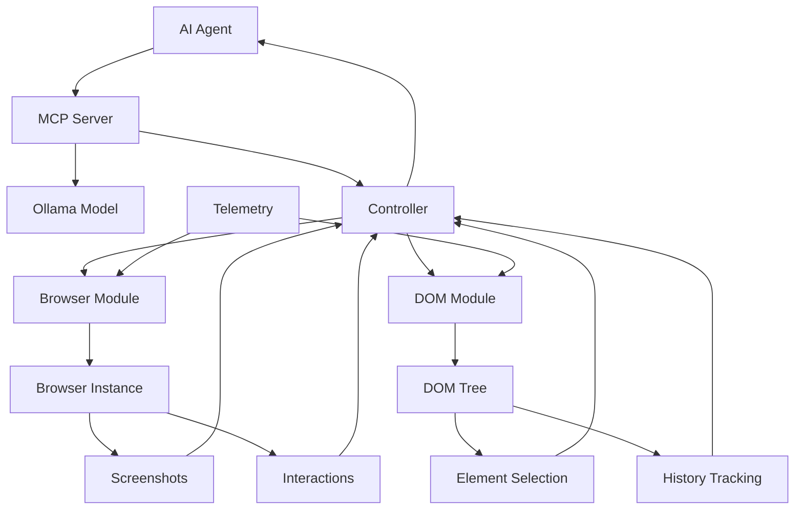
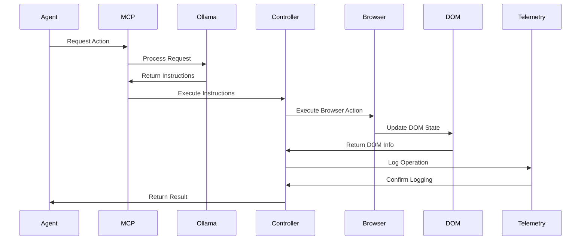

# System Flow Diagrams

## Main System Flow



## Component Communication



## Module Architecture

```mermaid
graph LR
    subgraph MCP Layer
        M[MCP Server]
        O[Ollama Integration]
    end
    
    subgraph Agent Layer
        A[Agent Service]
        B[Message Manager]
    end
    
    subgraph Control Layer
        C[Controller Service]
        D[Registry Service]
    end
    
    subgraph Browser Layer
        E[Browser Service]
        F[Context Manager]
    end
    
    subgraph DOM Layer
        G[DOM Service]
        H[History Processor]
    end
    
    M --> O
    A --> M
    B --> M
    M --> C
    C --> D
    D --> E
    D --> G
    E --> F
    G --> H
